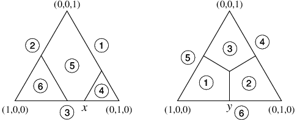

Project ideas for 2016
======================

.. would like to have small TOC here or in sidebar but don't
   know how

Re-design of GTE in HTML5/JavaScript
^^^^^^^^^^^^^^^^^^^^^^^^^^^^^^^^^^^^

* **Languages:** JavaScript, HTML5, some Java
* **Prerequisites:**  
  experience in JavaScript with large modules
* **How to get started:**  

  - Explore the behavior of the (existing, Flash) `GTE software <http://gte.csc.liv.ac.uk/gte/builder/>`_.
  - browse the (current, development, JavaScript) version at
    https://github.com/gambitproject/jsgte
    and clone it with 
    ``git clone https://github.com/gambitproject/jsgte.git``
  - then open the file (``.`` = directory from which you started the
    ``git clone`` command) ``./jsgte/html/index.html`` in your
    web browser and explore the behavior that you see
  - you can also look at it directly in the gh-pages version
    at
    http://gambitproject.github.io/jsgte/

GTE provides a browser front-end for creating game trees and games in 
strategic form (defined by payoff tables).
The game is "solved" by computing its Nash equilibria via various algorithms
that are implemented in Java on a jetty server.

For the existing Flash program,
the `github repository <https://github.com/gambitproject/gte/wiki/_pages>`_
contains the source code for client and server software and
the 
`GTE webpage <http://www.gametheoryexplorer.org/>`_ has further documentation.

The browser (client) part is currently implemented as a Flash program 
in ActionScript, most of it in the ``gui-builder`` directory of the source code.
Flash is discontinued, and the code has become too
monolithic, so are currently rewriting 
this in HTML5 and Javascript with better modularization.
For the current state of this project, see
https://github.com/gambitproject/jsgte

If you would like to contribute as a developer,
we think that the exploring the use of the existing old software is a much better (and much more
rewarding) way to get started than trying to understand the
old Flash (ActionScript) code,
and in getting the system to run.
(The github repository gives detailed instructions, but it will still take
several hours to set everything up.)

We envisage **one GSoC student** to work on this core
project to extend the basic functionality, in very close
collaboration with us.
This will encompass:

- game tree input in one panel
- game matrix display in the second panel (merging the current "Strategic
  Form" and "Matrix Layout" panels)
- save/load to an internal XML format 
- export into graphics formats; currently in SVG
- (already partly implemented) multiple actions (such as adding a node or creating
  information sets) for all nodes on a level when the mouse
  pointer hovers at that level, for higher input speed, see
  https://github.com/gambitproject/gte/issues/32
- reliable undo functionality 
- some direct enhancements that are easy, such as less drastic deletion of
  subtrees, see https://github.com/gambitproject/gte/issues/11
- server communication (server will stay as is).

GUI Enhancements for GTE
^^^^^^^^^^^^^^^^^^^^^^^^

* **Languages:** JavaScript, HTML5
* **Prerequisites:**  
  interest in graph drawing algorithms and in implementing WYSIWYG behavior
* **How to get started:**  
  Study the issues listed below,
  explore the behavior of the `GTE software <http://gte.csc.liv.ac.uk/gte/builder/>`_.

In addition to replicating the existing behavior in GTE, the current
behavior can be improved in various places.
This work is orthogonal to the main re-implementation and
will integrate into it once a game tree can be drawn (one of
the first steps of the main project).

We think of **one GSoC student** for this project.
The first and last of the following items are larger
projects and can be combined with others.

* improved game tree drawing. In general the game tree looks good but sometimes
  has crossing lines, see https://github.com/gambitproject/gte/issues/17.
  This is an interesting algorithmic problem from graph drawing.

* drawing information sets across multiple levels if the
  game tree does not have a unique time structure. May
  require Bezier curves instead of ovals and possibly
  challenging mouseclick detection if SVG is chosen for
  display

* ability to enter mathematical text in LaTeX style, such as ``x_i``
  that is then displayed properly (so not quite WYSIWIG:
  display is after completing the text entry), here with
  subscripts as in  x\ :sub:`i`\  

* allow replacement of numerical values for chance
  probabilities and payoffs with parameters, see
  https://github.com/gambitproject/gte/issues/31

* option to swap players easily

* remembering directories for save/load, see https://github.com/gambitproject/gte/issues/13

* graphical display of computational outputs.  
  Computational output comes from the server but is
  currently only ASCII text. Processing this output is
  relatively orthogonal to GUI input, but will use the
  tree and game matrix display for:

  - equilibrium display by shading table cells in the
    support of an equilibrium, with graphical display of
    mixed strategy probabilities;

  - similarly, highlighting reached parts of a game tree in
    equilibrium and choice probabilities;

  - geometric representation (2D and 3D) of equilibrium components.

Displaying equilibrium diagrams for learning about game theory algorithms
^^^^^^^^^^^^^^^^^^^^^^^^^^^^^^^^^^^^^^^^^^^^^^^^^^^^^^^^^^^^^^^^^^^^^^^^^

* **Languages:** JavaScript, HTML5
* **Prerequisites:**
  interest in geometry, background in game theory, willingness to
  study basics of game-theoretic algorithms,
  interest in science education;
  experience with inkscape (SVG) or xfig welcome
* **How to get started:** Follow the link and read
    Rahul Savani and Bernhard von Stengel (2015),
    `Game Theory Explorer -- Software for the Applied Game Theorist
    <http://www.maths.lse.ac.uk/Personal/stengel/TEXTE/largeongte.pdf>`_.
    *Computational Management Science* 12, 5-33.

This is a new addition to GTE, for **one GSoC student**.
The goal is to display geometric diagrams that conveniently
allow the identification of the Nash equilibria of the given game.
It works best for small two-player games (at least one
player should not have more that three strategies), and also
helps to understand how equilibrium computation algorithms
work.
Its purpose is primarily educational.
The display will be associated with the game matrix shown in
GTE.

The following drawings should be created interactively, with
image manipulation creating the game, or the game creating
the image, here for a 3x3 game:

- upper envelope diagrams:

- for a prototype interactive flash program that generates
  such a picture, as shown next, see (and choose the 3xn
  panel)
  http://www.maths.lse.ac.uk/Personal/stengel/UpperEnv.swf

- corresponding polytopes:

- strategy sets subdivided into labeled best response regions:

- display of the path computed by the Lemke-Howson algorithm:

- also on the graph of a single polytope, for symmetric games:
.. figure:: _images/colorpaths.png

- in addition to the interactive creation of the games and
  associated pictures, the program should offer export to
  various graphics file formats for use in lectures and in
  educational materials.

