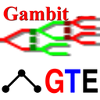

.. |beta| unicode:: U+03B2
.. |copy| unicode:: U+000A9 

Gambit: Software Tools for Game Theory 
--------------------------------------

Ideas list for GSoC 2016
------------------------

We are applying for studentships from the Google Summer of Code 2016,
following successful GSoC participation in 2011, 2012, and 2014.

We are currently designing a major overhaul of the software with exciting 
opportunities that, from our previous GSoC experience, will be well suited to
GSoC students.

Our `project ideas <#project-ideas-for-2016>`_
are listed below (and are regularly updated).
	.. comment
	.. We will also give below instructions on how to apply - which will be relevant
	.. when, as we hope, we have been accepted as an organisation to GSoC 2016.

Last change: |today|

.. toctree::
   :maxdepth: 2 

   Game Theory Explorer Software link <http://gte.csc.liv.ac.uk/gte/builder/> 
   overview
   ideas2016
   GTE homepage <http://www.gametheoryexplorer.org/>
   Gambit homepage <http://www.gambit-project.org/>

