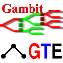

.. |beta| unicode:: U+03B2
.. |copy| unicode:: U+000A9 

Ideas list for GSoC 2015
------------------------

We are applying for sponsorship by the Google Summer of Code 2015.

Welcome to the homepage for Game Theory Explorer |beta|, which is a
software tool to create and analyze games as models of strategic interaction.
An extensive or strategic-form game can be created and nicely displayed with a
graphical user interface in a web browser. State-of-the-art algorithms then
compute one or all Nash equilibria of the game.

.. admonition:: Click on the logo to start Game Theory Explorer 

    .. figure:: _images/horiz8.png
        :figwidth: 60%
        :target: http://gte.csc.liv.ac.uk/gte/builder/ 

        This will launch Game Theory Explorer in a new browser window
        where you can create and solve games; right-click if you have pop-ups blocked.

For further information please navigate the links on the right.

Note that this is a |beta| ("beta") software version still under development, so
please be patient with misbehaviour and bugs.

Please send all comments to: gte@nash.lse.ac.uk 

Last change: |today|

.. toctree::
   :maxdepth: 2 

   Game Theory Explorer Software link <http://gte.csc.liv.ac.uk/gte/builder/> 
   documentation
   development
   ideas
   ideasALG
   contributors
   Gambit <http://www.gambit-project.org/>
   Old Bimatrix Game Solver "banach" <http://banach.lse.ac.uk/form.html>
